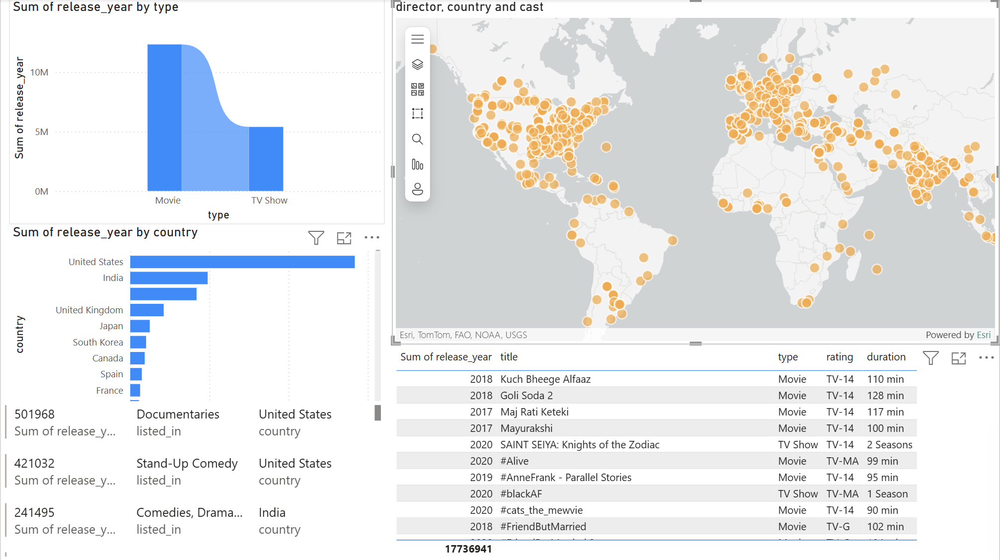
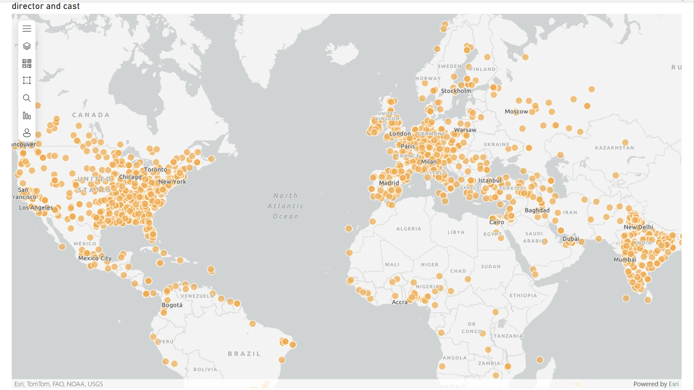
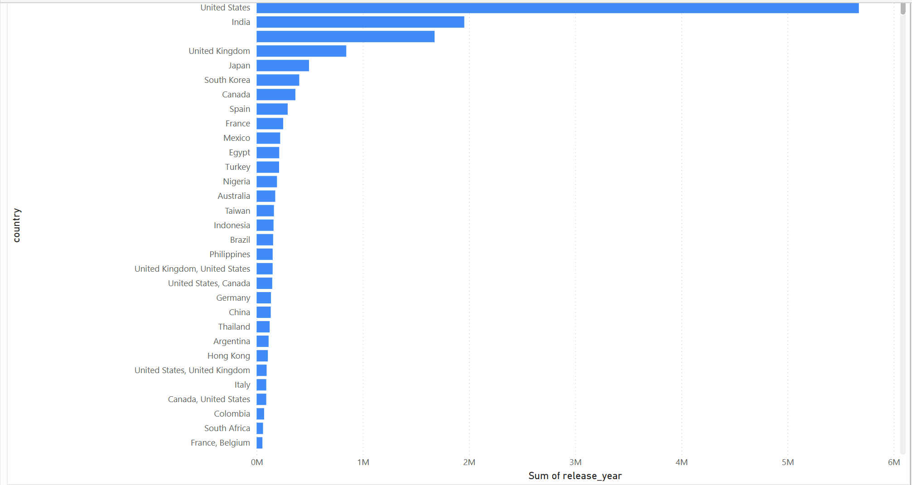

# 🎬 Netflix Analytics Dashboard (Power BI)

This Power BI project analyzes Netflix's catalog of TV Shows and Movies using an interactive business intelligence dashboard. The goal is to uncover insights related to content type, country distribution, release trends, and category listings.

---

## 🚀 Project Goals

- Build a centralized dashboard for Netflix content insights.
- Analyze global distribution of shows and movies.
- Track trends by release year, duration, and genre.
- Recommend strategic areas for content production/targeting.

---

## 📁 Files Included

- `Netflix-dashboard.pbix` – Main Power BI report file.(./Netfilx-dashboard.pbix) |
- `netflix-shows.csv` – Cleaned dataset used for the dashboard.(./netfilx-shows.csv) |
- `visuals/` – Screenshots of the dashboard and supporting visuals.

---

## 📊 Screenshots

Here are the key visuals from Power Bi file

| Visual | Description |
|--------|-------------|
|  | Main dashboard displaying KPIs like show count, top genres, and release trends. |
|  | Visual displaying of director and cast. |
|  | Visual comparison of shows per country. |
---

## 📈 KPIs & Metrics

- Total Titles on Netflix
- % of TV Shows vs Movies
- Top 10 Countries by Content
- Genre/Category Distribution
- Content Trends Over Years

---

## 🔄 Data Pipeline

**Source**: `netflix-shows.csv`  
**Steps**:
- Imported via Power BI Power Query
- Cleaned missing values
- Created calculated columns (e.g., content type, duration)
- Built visual dashboard with slicers, filters, and KPIs

---

## 💡 Insights

- The U.S. dominates content creation on Netflix.
- TV Shows are gaining popularity, especially post-2018.
- Drama, International Shows, and Documentaries are the most common genres.
- Netflix heavily localizes content based on region.

---

## 🧠 Recommendations

- Increase investment in trending genres like docuseries and crime dramas.
- Focus content development in emerging markets like India and South Korea.
- Improve metadata consistency (e.g., for director, cast, country) to enhance discoverability.

---

## 📌 How to Use

1. Clone/download the repository.
2. Open the `.pbix` file in Power BI Desktop.
3. Explore filters, visuals, and insights interactively.

---

## 👤 Author

**Shivank Giri**  
[LinkedIn](www.linkedin.com/in/shivank-giri-4288b4316) | shivank1998@hotmail.com

---

## 📄 License

This project is open-source and available under the [MIT License](MIT License

Copyright (c) 2024 Shivank Giri

Permission is hereby granted, free of charge, to any person obtaining a copy
of this software and associated documentation files (the "Software"), to deal
in the Software without restriction, including without limitation the rights
to use, copy, modify, merge, publish, distribute, sublicense, and/or sell
copies of the Software, and to permit persons to whom the Software is
furnished to do so, subject to the following conditions:

The above copyright notice and this permission notice shall be included in all
copies or substantial portions of the Software.

THE SOFTWARE IS PROVIDED "AS IS", WITHOUT WARRANTY OF ANY KIND, EXPRESS OR
IMPLIED, INCLUDING BUT NOT LIMITED TO THE WARRANTIES OF MERCHANTABILITY,
FITNESS FOR A PARTICULAR PURPOSE AND NONINFRINGEMENT. IN NO EVENT SHALL THE
AUTHORS OR COPYRIGHT HOLDERS BE LIABLE FOR ANY CLAIM, DAMAGES OR OTHER
LIABILITY, WHETHER IN AN ACTION OF CONTRACT, TORT OR OTHERWISE, ARISING FROM,
OUT OF OR IN CONNECTION WITH THE SOFTWARE OR THE USE OR OTHER DEALINGS IN THE
SOFTWARE.
).
